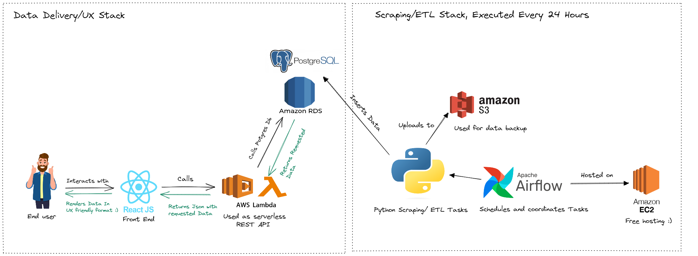
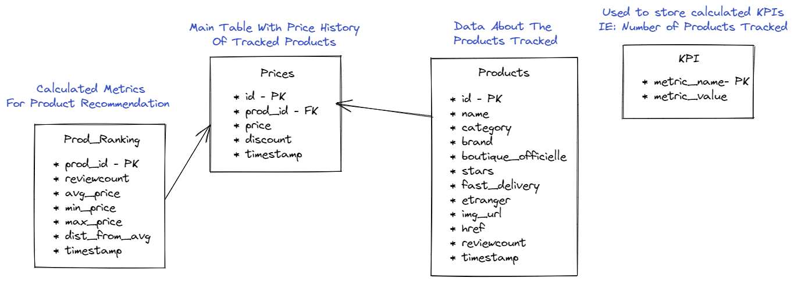
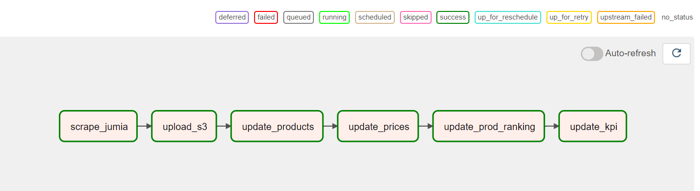
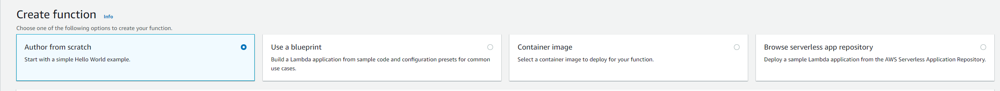
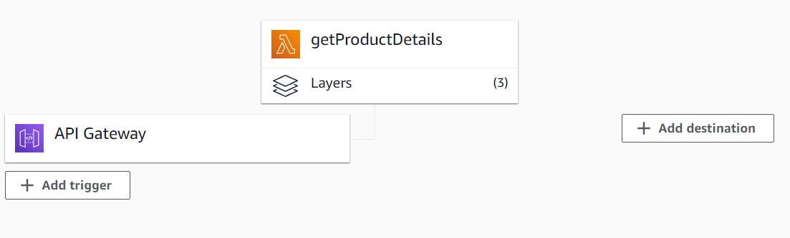
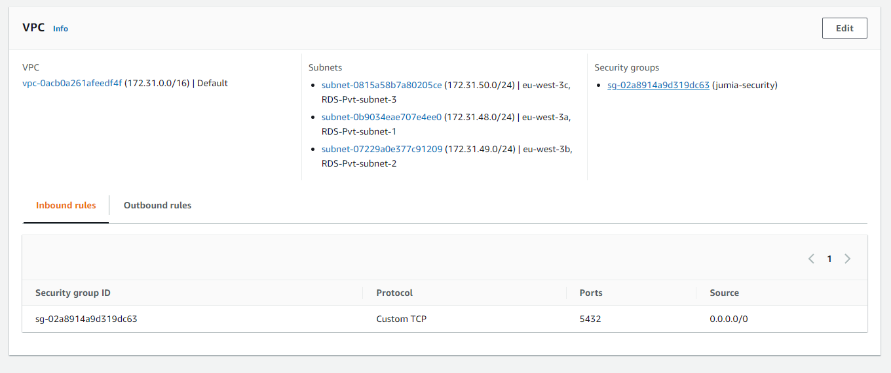

Have you ever wanted to track the prices of products on an ecommerce platform but found that no price tracker existed for that specific platform? In this article, I'll share with you how I built a Price Tracker app for Moroccan ecommerce platforms and hosted it on AWS for free. This simple end-to-end data engineering project includes some UX elements and will teach you about web scraping and how to use some of AWS's services. You can try the app using this [link](https://www.tariqmassaoudi.com/jumiaapp/).

### **The Context & The Plan:**

The main value of a Price Tracker is to provide you with the historical price of a product so that you can make your purchasing decision based on data, among other criteria, and minimize the effect of FOMO/discounts that can be in some cases just a form of marketing.

Price trackers exist for all major international ecommerce websites, such as Amazon, eBay, and Alibaba, but they don't exist for ecommerce platforms in Morocco. The goal of this project is to create a simple price tracker and host it for free. To achieve the latter, I chose to make use of AWS free tier, which offers quite generous cloud resources, just enough to bootstrap this kind of project if used efficiently. Learn more about AWS Free Tier [Here](https://aws.amazon.com/free/)

### Technical Architecture:

The following picture summarizes the architecture I chose to spread out and make use of a variety of AWS components, which is more optimal for efficiency:

The architecture split into two main sections:

**Scraping/ETL:** This section is responsible for periodically getting the data, transforming it, and loading it into a Postgres database. I made use of Airflow for scheduling and coordinating tasks written in Python and S3 for an extra backup of the data.

**Data Delivery / UX :** In classic web app fashion, we have a front-end UI written in JavaScript, calling a REST API which is, in this case, powered by AWS Lambda, which interacts with our Postgres database in RDS. Making efficient use of resources like this is what made it possible to host the project for free.

### Data Model:

The main table, called "Prices," holds historical price data. We also maintain details about the products tracked in the "products" table and analytics/recommendations related data, such as "prod_ranking" and "KPI" tables.

### Generating the best deals:

To generate the best deals, we calculate the average price of a particular product and compare it to its actual price today, getting the percent difference. For example, in the picture below:

The product is down 27.62% from its average price. To further enhance recommendations, we prioritize popular products with the highest number of reviews by category.

### Deep Dive Into Scraping:

The first step is to get URLs of the categories, as shown below:

Now each category has multiple pages, and we use the page number as a variable to navigate and grab products on each page.

Below is the full scraping code, it utilizes python’s request module, beautifulsoup to parse html and and tqdm for multithreading which accelerates the task. To learn more about scraping I’d recommend my [article](https://medium.com/analytics-vidhya/every-data-scientist-needs-to-learn-this-4632e3a2e275) or similar content.

`gist:tariqmassaoudi/5152eae7e2b8ba384e9a0279e5b2b43e#scrapeJumia.py`

<!--  -->

### Airflow: A Powerful Task Scheduling Platform:

Airflow is a robust platform that enables users to create and run workflows using Directed Acyclic Graphs (DAGs) and tasks with dependencies and data flows taken into account. With Airflow, users can specify the order of execution and run retries as well as describe what to do with each task, such as fetching data, running analysis, triggering other systems, and more.

One of the most significant advantages of using Airflow is its user-friendly graphical interface, which allows you to track the progress of your tasks in real-time, while also providing built-in retry on failure and integration with most popular databases. Moreover, it stores the execution times and logs, making it incredibly useful for debugging.

To learn more about Airflow, check out the [official documentation](https://airflow.apache.org/docs/), which is the best place to get started. 

Below is the DAG used in the project, along with the main Python code used to generate it:

`gist:tariqmassaoudi/eb5d1310e21b9a0d1501067fe702f4d3#jumiaDag.py`

### AWS Lambda: A Serverless Backend Solution: 

  

Lambda functions are incredibly flexible and can be used for a wide range of applications. In this project, they were used as a REST API to offload the workload from the main EC2 server. It's easy to get started with Lambda, simply choose your preferred language and start a function from scratch or use a container or one of the provided AWS blueprints.

Once you've created your function, you'll need to set it up for your use case. In my experience, this includes setting up "layers," which allow your function to use external libraries such as pandas and sqlalchemy. You'll also need to set up the REST API to call the function from the web, enabling CORS (Cross-Origin Resource Sharing) to allow calls from your browser. The AWS [documentation](https://docs.aws.amazon.com/apigateway/latest/developerguide/how-to-cors.html) does an excellent job of explaining this.

After setting up your Lambda function, you'll have a function with layers and an API gateway:

To enable your function to communicate with your RDS database, you'll need to connect it to a VPC in the same subnets as your RDS setup and create a "security group" that allows connection on the Postgres port 5432 and assign it to the function:

Here's an example of a function that gets product details given a product ID or URL:

`gist:tariqmassaoudi/0c5c7a75923a9124f329ea49c46c2b46#getProduct.py`

### Conclusion:

It was an exciting and fulfilling experience working on this project, as it has real-world applications for the average person. AWS's free tier offers a generous package, making it ideal for prototyping compared to the competition. As long as you use it efficiently and do not exceed the limits, you can host almost any project.

Thank you for reading this article. We hope you found it informative and learned something new. If you have any questions or would like to discuss further, feel free to reach out on LinkedIn: [LinkedIn](https://www.linkedin.com/in/tariqmassaoudi/).
